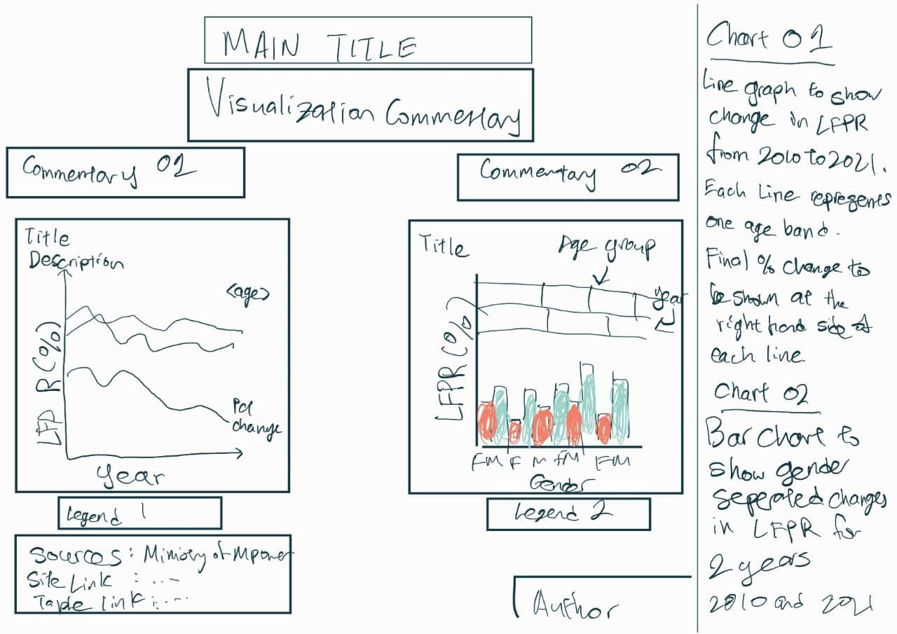

```{r setup, include=FALSE}
knitr::opts_chunk$set(echo = FALSE)
```

```{r}
packages = c('tidyverse')

for(p in packages){library
  if(!require(p, character.only = T)){
    install.packages(p)
  }
  library(p,character.only = T)
}
```


For this DataViz Makeover, i am using data from the [Ministry of Manpower's Research and Statistics Department](https://stats.mom.gov.sg/Pages/LabourForceTimeSeries.aspx). The data set chosen contains data regarding Singapore's Resident Labour Force Participation Rate (LFPR) by Age and Sex.

___Section 1: Critique of Visualization___

Before I introduce my own visualization, I will first critique the following visualization as part of the assignment.

```{r, echo = FALSE, fig.align = 'center', out.width = '60%', results = 'markup'} 
knitr::include_graphics("img/OG.png")  
```
Figure 1: Original Visualization provided

Note: Labour Force Participation Rate (LFPR) refers to the percentage the population of legal working-age that are actively engaged in the labour market, either currently employed or seeking employment.

Assumptions: This visualization is trying to show the changes in Labour Force Participation Rate for each age-group over time (years).
__Clarity Critiques__

_Critic 1: X-axis labelled wrongly_
As shown in the diagram, the X-axis is based on 2 factors, Age-group and Year. We can see that all of the Year label for every age-group is 2015 and this will only serve lead readers to the wrong conclusions.
Because the diagram shows changes in the area graph, having only the year 2015 shown on the X-axis will lead to the assumption that the changes represent different ages in that Age-group in the year 2015. 
We know that this is not true since the data provided rate for each age-group instead of individual year, but most people do not.
Instead, the label should contain a range of the years contained within that graph, for example "2015 - 2021".

_Critic 2: Clashing Age-group_
Looking at the diagram, we can see that there are 3 age-groups that deal with workers in their 70s. They are: "70 to 74", "75 & Over" and "70 & Over". As the group "70 & over" is actually the combined result of both "70 to 74" and "75 & Over", it is redundant and the diagram would be better served using either "70 to 74" and "75 & Over" or just "70 & Over".

_Critic 3: Y-axis labelled in Short Form_
The Y-axis is labelled as "Lfpr" instead of the full "Labour Force Participation Rate" and it does not show the units involved which is %. As the diagram also does not explain what LFPR is, readers not in the know will be confused as to what it represents.
The Y'axis should be labelled as "Labour Force Participation Rate (%)" instead.

_Critic 4: No explanation to diagram purpose_
The visualization only comprises of the diagram and it's title which does not fully explain what the diagram represents nor what observers should be expecting to understand by looking at it.

Instead, the title should be a brief explaintaion of what the observer should expect to see, there should also be a small subtitle or commentary on the visualization.

__Aesthetics Critiques__

_Critic 1: Wrong visualization type chosen_

Based on my assumption above that the visualization is trying to show change in LFPR over time and compare between the age groups, the visualization type chosen is not very suitable as it does allow the reader to properly compare the rate of change shown, instead a line graph would be more suitable, especially given the number of age-groups included in the graph.

_Critic 2: Too many age-groups bins_

The diagram contains too many age-group bins, thus the amount of space per bin is small and unable to properly show the points of each year involved in the diagram. Observers are thus unable to tell which year does the particular change occur without hovering over that point.
The diagram should have shown either selecetd age-groups or wider-rage age groups.

_Critic 3: Does not show any point in the dragram_

There are no points labelled in the diagram that observers can use for reference. Instead, they are only able to see the general trend of the line.
The diagram should have at least 2 points shown from each age-group so that observers can infer the change over time or indicated the percentage change itself in a label.

___Proposed Design___
```{r, echo = FALSE, fig.align = 'center', out.width = '60%', results = 'markup'} 
  
```
Figure 2: Sketch of proposed design

__Advantages__

1) Visualization Title and Commentaries: Show how the LFPR has changed between 2010 and 2021. Also provides insights on more notable aspects like which groups are experiencing greater change.
2) Chart Titles and Commentary: Provides explainations and context into what the charts try to show.
3) Chart 1: Clearer comparisons of change since each age-group line is stretched out more. Wider range age-groups are selected in order to give a clearer view instead of cluttering the graph.
4) Chart 2: Provides new insights into the LFPR change by gender, allowing observers to see and compare the rate of change for males and females
5) Period of comparison: Both charts are to use 2010 and 2021 as the two selected points of comparison so that observers are able to see the overall change within the span of 10 years clearly. Values are also directly indicated so that straight comparisons can be made.


___Section 3: Data Preparation___

For my proposed visualization, I will only be using one table from the data set obtained.

Table: __mrsd_Res_LFPR_1__

