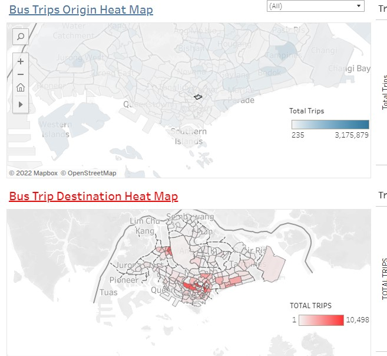

```{r setup, include=FALSE}
knitr::opts_chunk$set(echo = FALSE,
                     eval = TRUE,
                     warning = FALSE,
                     message = FALSE,
                     fig.retina = 3)
```


```{r}
packages = c('readr')

for(p in packages){library
  if(!require(p, character.only = T)){
    install.packages(p)
  }
  library(p,character.only = T)
}
```

# Introduction

For DataViz Makeover 02, the goal is to reveal inter- and intra-zonal public bus flows at the planning subzone level.

We will be using data for the Origin-Destination records of all Bus Trips in Singapore for January 2022. The base dataset for this was obtained from [LTA Data Mall](https://datamall.lta.gov.sg/content/datamall/en.html)  and combined with planning area and subzone information via GIS Overlay operation.

Mapping data used was the [URA Master Plan 2014 Planning Subzone Boundary Map](https://data.gov.sg/dataset/master-plan-2014-subzone-boundary-web) obtained from data.gov.sg.

# Critique

The visualization prepared by [Prof Kam](https://faculty.smu.edu.sg/profile/kam-tin-seong-486) for the critique part of this makeover is shown as below. 

```{r, echo = FALSE, fig.align = 'center', out.width = '100%', results = 'markup'} 
  
```

## Clarity Critiques

__No Title and Subtitle__

The visualization as a whole had no title or subtitle, there were only titles for each individual graph. Readers do not know what they are supposed to understand from the entire visualization even if they know what each graph is showing. 

Recommendation: A title is a mandatory requirement for visualization since it would give the users an idea of what they are looking at so that they can better understand the entire visualization.

__No information regarding the data__

In most cases, the visualization would at least contain a brief introduction on what the overall data set used was, when and where it came from, but there was no such introduction in this visualization. Reader would thus be unsure of what information they are inferring since they are not able to have a proper grasp on where and and when this data was collected and represents.

Recommendation: Information regarding the dataset such as the dates they represent or where the data was collected should be included in either the title or subtitle.

__Incorrect Labeling (Bar Graph X-Axis)__

The label reads ‘time per hour’ and a reader’s first assumption would be that the x-axis shows the amount of time per hour is recorded/spent etc that the graph is trying to represent. Then when they look back at the title of the graph, “Trips attracted to XX“ and they will get confused since the title is implying that the graph should show number of trips to/from a station but the axis label is instead showing time per hour which doesn’t make sense.

Recommendation: Change labeling for X-axis to Time of Day for clearer communication of the 24 hours in a day.

__Over-compressed Adjacency Matrix__

Because of the amount of space available for the visualization is limited, the adjacency matrix has been compressed to the point where no usable information can be gained from it unless the cursor is hovered over a node to trigger the tooltip. To a reader, this matrix just looks extremely confusing since all the rows and columns are so cramped that it is difficult to even find the right node to hover over. This is made worse by the fact that the axis are so compact that there is no way to visually differentiate an individual "Row" or "Column" at all.

Recommendation: either reduce the number of rows and columns or use an alternate visualization method for this purpose. Given the importance of each sub zone to the entire visualization, the latter is more recommended.

__Difficult to compare bar chart results__

The Bar charts seem to be trying to show a comparison between the frequency of weekday trips against weekend trips for both origin and destination subzones, however it is difficult to do an exact comparison because the graphs are separated. Thus, readers will need to read back and forth on each point in order to get a more accurate reading of the differences which is tedious.

Recommendation: Combine the bar charts for weekday and weekend / holiday into 1 for easier comparisons

## Asthetics Critiques

__Single Color Bar Charts__

All of the bar charts are colored in the same shade of blue which make it harder to for users to differentiate between them. Having a different colors for different groups like Weekday vs Weekend would make it much easier to compare given that users will not be constantly looking at the same colors.

Recommendations: Use different colors for Weekday and Weekend / Holiday


__Unusable Adjacency Matrix__

As mentioned previously, the matrices are so compact that it is very difficult to extract information from them. Worse, because of their compactness, they are extremely displeasing to look at, especially the markings for the rows and columns.

Firstly, the columns for both matrices are so cramped that they resemble a black bar more than a row of words.

Secondly, the rows for weekend matrix is totally missing which might be a result of that matrix being compressed more than it's partner because of the need to meet the height of the weekend bar charts.

The rows for the weekday matrix are not much better, resembling a hodgepodge of words jumbled together.

Recommendation: Change the visualization method or give the matrices enough space to breathe and fit everything properly

__Filter column too exposed and long__

The filter column display method was multiple value selection list for both weekday and weekend that would change the bar chart. Due to the number of sub zones in Singapore, there was no way to squeeze all of them into one column space which resulted in the two filters having to be scrolled down to access all of the sub zone. This not only took up valuable space that could have been put to better use but also looks very ugly.

Recommendation: Use a drop-down list instead so as to hide all the options away. Additionally, using float would allow the list to be placed in the empty space around the bar charts.


# Proposed Design

Based on the recommendation for the critiques above, I propose the following design.

```{r, echo = FALSE, fig.align = 'center', out.width = '100%', results = 'markup'} 
  
```

## Heat Maps of Singapore

This is a replacement to the adjacency matrices of the original visualization. 

Using the sub zone planning data, we are able to create maps of Singapore split by subzone which will allow readers to see the relative positions of the each sub zone more easily.

The idea is to use 2 maps of Singapore, the first will show the number of trips originating from each sub zone and the second will show the number of trips ending in each sub zone. 2 maps are used instead of 1 because putting both start and end into 1 map would make it extremely difficult to read and impossible to compare. 

The heat map will differentiate by color, where the darker the color will mean the greater the number of trip to/from that sub zone

With 2 maps, we will also be able to do filtering based on sub zone selection in either maps. This way, readers will be able to observe the how strongly the various sub zone are connected via trips. For example, selecting "Kovan" in the origin heat map will result in the destination heat map filtering for sub zones that have trips starting from Kovan, thus readers can see which are the common destinations for bus trips from Kovan. The same works for the reverse where selecting a sub zone in the destination heat map will filter for sub zones with trips that end in the selected one.


Additionally, the maps will have a popup tooltip that shows the top 3 trip origins or destinations (depending on which map) for that sub zone as well as the number of trips to and from that sub zone that will depend on whether the filter is used or not.

## Bar Charts

Next to each heat map are the bar charts that represent the frequency of trips to and from the sub zones. The charts are an improvement to the original ones where the weekday and weekend charts are combined together with a weekday+weekend bar chart to form the final result. It allows for readers to make comparison for all 3 categories of Days much easier compared to before.
Additionally, the chart is also affected by the filter from the heat maps. 

__Proposed Filter Results__

No filter: Shows frequency distribution for the all sub zones

Selecting a Sub Zone in the Origin Heat Map (eg Kovan): 
The Origin Bar chart shows the frequency of trips from Kovan to all locations
The Ending Bar Chart shows the frequency of trip from Kovan that end in Kovan

Selecting a Sub Zone in the Destination Heat Map (eg Hougang):
The Origin Bar Chart shows the frequency of trips from Hougang that end in Hougang.
The Ending Bar chart shows the frequency of trips from all locations that end in Hougang


# Creating the Visualization

## Loading the Data

For this exercise, we did not need to do any data cleaning or transformation as the data was already prepared by our instructor.

<table>
<tr>
  <th>Item</th>
  <th>Steps</th>
  <th>Images</th>
</tr>

<tr style="height:50px">
  <td>1</td>
  <td>We'll be use the origin_destination_bus_sz file and the .shp SUBZONE file. Make sure you have them.</td>
  <td></td>
</tr>

<tr style="height:50px">
  <td>2</td>
  <td>Drop both into your tableau. You should get two files available as seen on the right in the files pane</td>
  <td></td>
</tr>

<tr style="height:50px">
  <td>3</td>
  <td>Drag origin_destination file to the data pane then followed by the shp file to it's right. It should result in a connection like so.</td>
  <td></td>
</tr>

<tr style="height:50px">
  <td>4</td>
  <td>Rename the origin_destination table to "Origin" first.</td>
  <td></td>
</tr>

<tr style="height:50px">
  <td>5</td>
  <td>Click on the line connecting the table to bring up the relationship selection below.
   
   Select Origin SZ on the left and Subzone N on the right.</td>
  <td></td>
</tr>

<tr style="height:50px">
  <td>6</td>
  <td> Drag another origin_destination table from the files pane to the right of the MP14_SUBZONE node</td>
  <td></td>
</tr>

<tr style="height:50px">
  <td>7</td>
  <td>Rename the new node "Destination" </td>
  <td></td>
</tr>

<tr style="height:50px">
  <td>8</td>
  <td> Clink on the relationship link between MP14_SUBZONE and Destination and change the left-most field to Subzone N and the right field to DESTINATION_SZ as shown in the image</td>
  <td></td>
</tr>

<tr style="height:50px">
  <td>9</td>
  <td> Click on the Origin table and click on the arrow at the top right of the Time_Per_Hour column. Rename it to "Time of Day".
  
  Do the same for the Destination table but change it to "TIME OF DAY" instead as Tableau doesn't allow us to change to the same name.</td>
  <td></td>
</tr>

<tr style="height:50px">
  <td>10</td>
  <td> Rename the file title to DataViz Makeover 02 and you should get the following result. You may choose to extract the data if you like, but it is optional.</td>
  <td></td>
</tr>

</table>

## Creating the First Heat Map: Bus Trips Origin

For this map, we will only be using the __Origin__ and __MP14_SUBZONE__ tables

<table>
<tr>
  <th>Item</th>
  <th>Steps</th>
  <th>Images</th>
</tr>

<tr style="height:50px">
  <td>1</td>
  <td> In sheet 1, drag geometry from the MP14_SUBZONE table to the centre of the sheet to get the base Singapore Sub Zone map.</td>
  <td></td>
</tr>

<tr style="height:50px">
  <td>2</td>
  <td>From the "Origin" table, drag Origin SZ to Color and Total Trips to Detail under Marks</td>
  <td></td>
</tr>

<tr style="height:50px">
  <td>3</td>
  <td> Drag Day Type to the Filters box and select "All" and OK</td>
  <td></td>
</tr>

<tr style="height:50px">
  <td>4</td>
  <td>Right click the Day Type pill and click show filter.</td>
  <td></td>
</tr>

<tr style="height:50px">
  <td>5</td>
  <td> Left click the downward arrow on the filter panel for Day Type and select "Single Value (dropdown)"</td>
  <td></td>
</tr>

<tr style="height:50px">
  <td>6</td>
  <td> Rename the sheet to "Origin" and the map title to "Bus Trips Origin Heat Map". Bold, Underline and change the color to blue</td>
  <td></td>
</tr>

</table>

## Creating the Second Heat Map: Bus Trip Destination Heat Map

for this map, we will use the __MP14_SUBZONE__ and __Destination__ tables

<table>
<tr>
  <th>Item</th>
  <th>Steps</th>
  <th>Images</th>
</tr>

<tr style="height:50px">
  <td>1</td>
  <td>Create a new sheet using the button in the tab selection section at the bottom.</td>
  <td></td>
</tr>

<tr style="height:50px">
  <td>2</td>
  <td>In this sheet, drag geometry from the MP14_SUBZONE table to the centre of the sheet.</td>
  <td></td>
</tr>

<tr style="height:50px">
  <td>3</td>
  <td>From the Destination table, drag TOTAL_TRIPS to Color and DESTINATION_SZ to Detail under Marks</td>
  <td></td>
</tr>

<tr style="height:50px">
  <td>4</td>
  <td>Right Click the colored bar at the far right to edit the color.</td>
  <td></td>
</tr>

<tr style="height:50px">
  <td>5</td>
  <td> Change the color to the Red in the top right cornor</td>
  <td></td>
</tr>

<tr style="height:50px">
  <td>6</td>
  <td>Drag DAY_TYPE to the Filters box</td>
  <td></td>
</tr>

<tr style="height:50px">
  <td>7</td>
  <td>Right click the DAY_TYPE pill and choose "Show Filters".
  
  Once done, edit the filter to "Single Value (dropdown)"</td>
  <td></td>
</tr>

<tr style="height:50px">
  <td>8</td>
  <td> Edit the title to the following: "Bus Trip Destination Heat Map"</td>
  <td></td>
</tr>

</table>

## Creating the First Bar Chart: Trip Origin Frequency by Time of Day

For this bar chart, we will using the __Origin__ and __MP14_SUBZONE__ tables only.

<table>
<tr>
  <th>Item</th>
  <th>Steps</th>
  <th>Images</th>
</tr>

<tr style="height:50px">
  <td>1</td>
  <td>Create a new sheet</td>
  <td></td>
</tr>

<tr style="height:50px">
  <td>2</td>
  <td>Change the name of the to "OriginLine" by right clicking the tab. 
  
  Ignore the title change in the image, it will be changed again to the final version later.</td>
  <td></td>
</tr>

<tr style="height:50px">
  <td>3</td>
  <td> Right click "Time of Day" and select "Convert to Dimension"</td>
  <td></td>
</tr>

<tr style="height:50px">
  <td>4</td>
  <td> Drag "Time of Day" to the columns section and "Total Trips" to the column section. </td>
  <td></td>
</tr>

<tr style="height:50px">
  <td>5</td>
  <td> Click on "Total Trips" in the table section again and drag it to the edge of the graph where the zip line appears and drop it there.</td>
  <td></td>
</tr>

<tr style="height:50px">
  <td>6</td>
  <td> Select the "All" tab under marks and change the dropdown from automatic to "Bar"</td>
  <td></td>
</tr>

<tr style="height:50px">
  <td>7</td>
  <td> Open the lowest Marks tab and drag "Day Type" to the color section</td>
  <td></td>
</tr>

<tr style="height:50px">
  <td>8</td>
  <td> Click on "Edit Color" in the Day Type legend on the right side</td>
  <td></td>
</tr>

<tr style="height:50px">
  <td>9</td>
  <td> Change to Weekday to "Green" and Weekends/Holidays to "Orange"</td>
  <td></td>
</tr>

<tr style="height:50px">
  <td>10</td>
  <td> Click on the "Analysis" tab at the top and select Stack Marks then "Off" to deactivate it</td>
  <td></td>
</tr>

  <tr style="height:50px">
  <td>11</td>
  <td> Open the 2nd Marks tab and click on color. Change it to Grey. The graph should now show Grey and Green bars</td>
  <td></td>
</tr>

<tr style="height:50px">
  <td>12</td>
  <td>Right click on the second Y axis in the graph and select "Synchronize Axis", ensure that it is ticked.</td>
  <td></td>
</tr>

<tr style="height:50px">
  <td>13</td>
  <td>Drag "Origin Sz" to the Filters section and select all then OK</td>
  <td></td>
</tr>

<tr style="height:50px">
  <td>14</td>
  <td>Right click on the Day_Type legend arrow again and click Sort then change to "Descending Order". The graph should now show all 3 colors</td>
  <td></td>
</tr>

<tr style="height:50px">
  <td>15</td>
  <td>Right Click the second Y-axis again and click "Show Header" to hide it</td>
  <td></td>
</tr>

<tr style="height:50px">
  <td>16</td>
  <td>Click on the view options next to the pin button above the columns as shown in the image and select "Entire View"</td>
  <td></td>
</tr>

  <tr style="height:50px">
  <td>17</td>
  <td> Right click on the title and follow the image</td>
  <td></td>
</tr>

</table>


## Creating the second Bar Chart: Trip Ending Frequency By Time of Day

For this bar chart, we will using the __Destination__ and __MP14_SUBZONE__ tables only.
Ignore the title shown in the images as those were working titles.

<table>
<tr>
  <th>Item</th>
  <th>Steps</th>
  <th>Images</th>
</tr>

<tr style="height:50px">
  <td>1</td>
  <td>Create a new sheet</td>
  <td></td>
</tr>

<tr style="height:50px">
  <td>2</td>
  <td>Drag "TIME OF DAY" to Columns and "TOTAL TRIPS" to Rows</td>
  <td></td>
</tr>

<tr style="height:50px">
  <td>3</td>
  <td>Select the All tab under marks and change graph to Bar</td>
  <td></td>
</tr>

<tr style="height:50px">
  <td>4</td>
  <td>Click on the last Marks tab and drag "DAY_TYPE" to Colors</td>
  <td></td>
</tr>

<tr style="height:50px">
  <td>5</td>
  <td>Click on "Edit Color" in the DAY_TYPE legend on the right side</td>
  <td></td>
</tr>

<tr style="height:50px">
  <td>6</td>
  <td>Change to Weekday to "Green" and Weekends/Holidays to "Orange"</td>
  <td></td>
</tr>

<tr style="height:50px">
  <td>7</td>
  <td>Click on the Analysis tab and turn off Stack Marks</td>
  <td></td>
</tr>

<tr style="height:50px">
  <td>8</td>
  <td>Right-click the 2nd Y-Axis and select Synchronize Axis</td>
  <td></td>
</tr>

<tr style="height:50px">
  <td>9</td>
  <td>Click on the arrow for DAY_TYPE again and select Sort. Sort by descending Order</td>
  <td></td>
</tr>

<tr style="height:50px">
  <td>10</td>
  <td>Drag "DESTINATION_SZ" to the Filters section and select All then OK</td>
  <td></td>
</tr>

<tr style="height:50px">
  <td>11</td>
  <td>Open the 2nd Marks tab and click color. Change color to grey as shown in the image</td>
  <td></td>
</tr>

<tr style="height:50px">
  <td>12</td>
  <td>Edit the chart title according to the image shown</td>
  <td></td>
</tr>

<tr style="height:50px">
  <td>13</td>
  <td>Change the name of the sheet to "DestinationLine"</td>
  <td></td>
</tr>


</table>

## Creating the Top 3 Destination table for Tooltip

For this section, we will using the __Origin__ table only.


<table>
<tr>
  <th>Item</th>
  <th>Steps</th>
  <th>Images</th>
</tr>

<tr style="height:50px">
  <td></td>
  <td></td>
  <td></td>
</tr>

<tr style="height:50px">
  <td>1</td>
  <td>Create a new sheet and change the name to "OT"</td>
  <td></td>
</tr>

<tr style="height:50px">
  <td>2</td>
  <td>Drag "Destination Sz" to Columns, "Origin Sz" and "Day Type" to Rows in that order.
  
  After that, drag "Total Trips" to the Text box in the Marks section.</td>
  <td></td>
</tr>

<tr style="height:50px">
  <td>3</td>
  <td>Click on the Analysis tab at the top and select "Percentage Of" then select Row</td>
  <td></td>
</tr>

<tr style="height:50px">
  <td>4</td>
  <td>Right click the Destination Sz pill in columns and select Sort By. Sort in Descending Order</td>
  <td></td>
</tr>

<tr style="height:50px">
  <td>5</td>
  <td>Go to the "Origin" map and select Tooltip in the Marks section. Change the tooltip according to the image.
  
  Use the Insert function to insert the sheet and the sum(total trips) function</td>
  <td></td>
</tr>

<tr style="height:50px">
  <td>6</td>
  <td>Go back to the OT tab, there should now be a Tooltip pill in the Filters section. Right click the right arrow there and select "Add to Context"</td>
  <td></td>
</tr>

<tr style="height:50px">
  <td>7</td>
  <td>Right click on the Destination Sz pill in columns and select Filter.
  
  In the filter, go to the new Top section and select "Field" than change it to Top 3 according to the image shown</td>
  <td></td>
</tr>

<tr style="height:50px">
  <td>8</td>
  <td>You should get the following result</td>
  <td></td>
</tr>

</table>

## Creating the Top 3 Origin table for tooltip

For this section, we will using the __Destination__ table only.

<table>
<tr>
  <th>Item</th>
  <th>Steps</th>
  <th>Images</th>
</tr>

<tr style="height:50px">
  <td>1</td>
  <td>Same as before, create a new sheet. This time rename it to "DT"</td>
  <td></td>
</tr>

<tr style="height:50px">
  <td>2</td>
  <td>Drag "DESTINATION_SZ" and "DAY_TYPE" to Rows and "TOTAL_TRIPS" to the Text under Marks</td>
  <td></td>
</tr>

<tr style="height:50px">
  <td>3</td>
  <td>Drag "ORIGIN SZ" to Columns and open the Analysis Tab.
  
  Change Percentage Of to "Rows".</td>
  <td></td>
</tr>

<tr style="height:50px">
  <td>4</td>
  <td>Go to the "Destination" map and edit the Tooltip according to the image shown. Use the insert function to insert the sheet and function</td>
  <td></td>
</tr>

<tr style="height:50px">
  <td>5</td>
  <td>Return to the DT sheet and right click the Tooltip filter to "Add to Context"</td>
  <td></td>
</tr>

<tr style="height:50px">
  <td>6</td>
  <td>Right Click the Origin Pill and select Filter</td>
  <td></td>
</tr>

<tr style="height:50px">
  <td>7</td>
  <td>In Filter, select "Top" and "By Field" than enter 3</td>
  <td></td>
</tr>

</table>

## Creating the Dashboard

Here we will be putting all of the previous sheets together into 1 to create our final visualization.

<table>
<tr>
  <th>Item</th>
  <th>Steps</th>
  <th>Images</th>
</tr>

<tr style="height:50px">
  <td>1</td>
  <td>Create a dashboard using the button in the Tabs section</td>
  <td></td>
</tr>

<tr style="height:50px">
  <td>2</td>
  <td>In the dashboard, select Origin from sheets and drag it to the centre</td>
  <td></td>
</tr>

<tr style="height:50px">
  <td>3</td>
  <td>Drag Destination to the bottom half of the Origin map</td>
  <td></td>
</tr>

<tr style="height:50px">
  <td>4</td>
  <td>Hover over the origin map and select the "Use as Filter" button. After clicking, that symbol should be filled. </td>
  <td></td>
</tr>

<tr style="height:50px">
  <td>5</td>
  <td>Go to dashboard in the top tabs and select Actions. 
  
  Or press Ctrl+Shift+D (for windows)</td>
  <td></td>
</tr>

<tr style="height:50px">
  <td>6</td>
  <td>Select the Filter available and select Edit</td>
  <td></td>
</tr>

<tr style="height:50px">
  <td>7</td>
  <td>Edit the action according to the image shown</td>
  <td></td>
</tr>

<tr style="height:50px">
  <td>8</td>
  <td>Hover over the destination map and select the "Use as Filter".</td>
  <td></td>
</tr>

<tr style="height:50px">
  <td>9</td>
  <td>Go to dashboard and open the actions again. Select the new filter and choose Edit</td>
  <td></td>
</tr>

<tr style="height:50px">
  <td>10</td>
  <td>Edit as shown in the Image</td>
  <td></td>
</tr>

<tr style="height:50px">
  <td>11</td>
  <td>On the "Day Type" filter on the right, select Apply to Worksheets and choose "Selected Worksheets"</td>
  <td></td>
</tr> 
 
<tr style="height:50px">
  <td>12</td>
  <td>Tick the box next to Destination as in the image</td>
  <td></td>
</tr>

<tr style="height:50px">
  <td>13</td>
  <td>Remove the "DAY_TYPE" filter since it's of no use anymore</td>
  <td></td>
</tr>

<tr style="height:50px">
  <td>14</td>
  <td>Drag the "OriginLine" option from sheets to the right of the Origin Heat Map</td>
  <td></td>
</tr>

<tr style="height:50px">
  <td>15</td>
  <td>Drag the "DestinationLine" option from sheet to the right of the Destination Heat Map</td>
  <td></td>
</tr>

<tr style="height:50px">
  <td>16</td>
  <td>Remove both the legends for the bar charts from the dashboard.</td>
  <td></td>
</tr>

<tr style="height:50px">
  <td>17</td>
  <td>In the Objects section, tick on "Show Dashboard Title"</td>
  <td></td>
</tr>

<tr style="height:50px">
  <td>18</td>
  <td>In the Objects section, drag Text to the region between the title and the Origin Map</td>
  <td></td>
</tr>

<tr style="height:50px">
  <td>19</td>
  <td>Hover over the filters/legends on the right and click on the white arrow. Select Floating and move them over the heat maps. Do it for all 3. 
  
  Final position for these will be shown later</td>
  <td></td>
</tr>

<tr style="height:50px">
  <td>20</td>
  <td>Remove the blank space left from the dashboard</td>
  <td></td>
</tr>

<tr style="height:50px">
  <td>21</td>
  <td>From Objects, drag Text to over the Trip Origin Bar chart</td>
  <td></td>
</tr>

<tr style="height:50px">
  <td>22</td>
  <td>Enter the Text as shown in the image</td>
  <td></td>
</tr>

<tr style="height:50px">
  <td>23</td>
  <td>Change the box to floating by clicking on the white arrow first then selecting "Floating". Drag it over the bar chart first, final position will be shown later.</td>
  <td></td>
</tr

<tr style="height:50px">
  <td>24</td>
  <td>Edit the title of the visualization using the following text as shown in the image
  
  "Frequency and Travel Patterns for Singapore Bus Trips, January 2022"
  Font: Tableau Bold, size 18
  Bold|Italic|Underlined</td>
  <td></td>
</tr>

<tr style="height:50px">
  <td>26</td>
  <td>Drag Text from Objects to the bottom of the visualization</td>
  <td></td>
</tr>

<tr style="height:50px">
  <td>27</td>
  <td>Enter the text as shown.
  
  "Source: URA Master Plan 2014 Planning Subzone Boundary Map (https://data.gov.sg/dataset/master-plan-2014-subzone-boundary-web)|Bus Origin Destination Data (https://datamall.lta.gov.sg/content/datamall/en.html)"
  
  Font Size: 7</td>
  <td></td>
</tr>

<tr style="height:50px">
  <td>28</td>
  <td>Open the actions menu again from dashboard and create a new Filter. Edit filter settings as shown in the image.</td>
  <td></td>
</tr>

<tr style="height:50px">
  <td>29</td>
  <td>Create another filter and edit as shown</td>
  <td></td>
</tr>

<tr style="height:50px">
  <td>30</td>
  <td>Create another filter and edit as shown again</td>
  <td></td>
</tr>

<tr style="height:50px">
  <td>31</td>
  <td>Create the last filter and edit as shown</td>
  <td></td>
</tr>

<tr style="height:50px">
  <td>32</td>
  <td>Double click the empty textbox below the title and change to the following.
  
  "The Heat Maps of Singapore show the pattern of bus trips beginning or ending in each subzone. The darker the color, the greater the number of trips. 
Selecting a particular subzone in either map will show filter the other map for subzones that are the beginning/ending of trips for the chosen subzone.
The bar charts show the frequency of trips according to each hour of the day for the chosen subzone or all subzone if none are selected. 
(Selected Day Type does not affect bar chart)"</td>
  <td></td>
</tr>

<tr style="height:50px">
  <td>33</td>
  <td> Move the Filters and legends into the positions as shown in the image. 
  
  Adjust the sizes accordingly</td>
  <td></td>
</tr>

<tr style="height:50px">
  <td>34</td>
  <td>Move the color bar for the destination heatmap into place</td>
  <td></td>
</tr>


<tr style="height:50px">
  <td>36</td>
  <td>Change the Dashboard name to DataViz 2</td>
  <td></td>
</tr>


</table>

# Final Visualization

After completing the steps above, it will result in the following visualization.

```{r, echo = FALSE, fig.align = 'center', out.width = '100%', results = 'markup'} 
knitr::include_graphics("img/final.jpg")  
```

# Insights

## Regional Flow Hubs

Looking at the heat map in it's whole form with no filters, it is immediately clear that there are 3 clusters which have high frequency of trips beginning and ending there.

```{r, echo = FALSE, fig.align = 'center', out.width = '100%', results = 'markup'} 
  
```

In the east, the cluster surrounds Tampiness and Bedok. In the North, the cluster is around Yishun and Woodlands and in the West the cluster is around Jurong West. These areas have been known as residential areas for several decades and the heatmaps supports this since residential areas would get more traffic as people travel to and from work everyday. 

## More Trips occuring in East Singapore

```{r, echo = FALSE, fig.align = 'center', out.width = '100%', results = 'markup'} 
  
```

From the heatmaps, we can also tell that there is much more flow of trips within the eastern region compared to the west as the Eastern sub zones are colored much darkner compared to the western sub zones. This is possibly due to a larger population in the East compared to West, especially in recent decades when the North-East areas like Hougang, Punggol started becoming more developed and more families moved in.

## Travel flow is highest to and from surrounding sub zones

```{r, echo = FALSE, fig.align = 'center', out.width = '100%', results = 'markup'} 
  
```

The figure above shows the origin of trips that end in Tampines East, the sub zone with highest origin and destinations in Singapore. It is clear that the surrounding sub zones contribute the most trips to Tampines, but hovering over other sub zones further our shows that there are still some trips from the North, South and Central Singapore to Tampines East. As expected the West had the fewest trips to Tampines East, given that a bus journey there is easily well over an hour in duration.

The same result can be seen from most parts of Singapore except for certain sub zones in the South.

```{r, echo = FALSE, fig.align = 'center', out.width = '100%', results = 'markup'} 
  
```

The figure above shows the destination sub zones of trips from Dhoby Ghaut which is a central location next to Plaza Singapore within the main entertainment district of Singapore. While msot trips originating there still end around the same region, we can see that there are a greater spread of destinations compared to the previous figure of Tampiness East.

This suggest that for residential sub zones, most of the bus trips are within the same region as people go to and from work or school nearby. Comparatively, because the south is where the CBD and shopping districts are, the spread of trip flow destination/origin is larger due to people from around Singapore heading there for either work or enjoyment.

## Peaks in Travel Flow more Pronounced in Weekdays compared to Weekends / Holidays

```{r, echo = FALSE, fig.align = 'center', out.width = '100%', results = 'markup'} 
knitr::include_graphics("img/insight5.jpg")  
```

The figure above is the Frequency Bar charts for the entire Singapore with no filter. We can see that overall, the trips made on weekdays far exceeds weekends which is expected as 1) there are more weekdays and 2) people travel for work on weekdays and less travel on the weekends.

However, we can see that there the trip frequency by hours is more even compared to the weekdays which has 2 pronounced peak periods, between 7 - 9 am and 5-7pm. These peaks can be attributed to the start and end of the work day for most workers which is when large numbers of people are travelling to and from work resulting in such a pronounced difference in frequency compared to the other timings.

The reason why weekends / holidays do not have pronounced peaks and instead a gentle curved peaking around the afternoon is because people dont have to go to work in the morning and can rest at home before going out in the later part of the day.